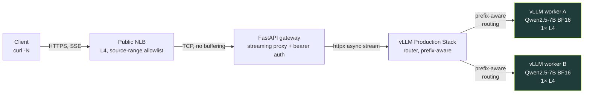

Every token leaves the GPU and arrives at the client without a single intermediate layer holding it in a buffer.


This is a self-hosted LLM serving stack on EKS. Two vLLM workers serve Qwen2.5-7B in bfloat16 on g6.2xlarge nodes, one model replica per GPU. A vLLM Production Stack router sits in front and makes prefix-aware routing decisions, steering repeated prompt prefixes to the same worker so the KV cache is warm. A FastAPI gateway handles auth and proxies the token stream to the network. A public Network Load Balancer takes it from there to the client. Five components; the constraint on each was the same: do not buffer.



- **Client** — any SSE-capable HTTP client; `curl -N` is enough.
- **Public NLB (L4, source-range allowlist)** — a TCP pipe; no HTTP parsing, nothing that can re-chunk an event stream.
- **FastAPI gateway (streaming proxy + bearer auth)** — validates a bearer token, opens an `httpx` async stream to the router, re-yields each chunk into a `StreamingResponse`.
- **vLLM Production Stack router (prefix-aware)** — routes each request to the worker most likely to have the prompt's KV prefix cached.
- **vLLM workers A and B (Qwen2.5-7B BF16, 1× L4 each)** — generate tokens and stream them over the OpenAI-compatible `/v1/chat/completions` endpoint with `stream=true`.


The rest of this post is the why, layer by layer.

## 1. Why streaming is the point

The first token is what humans feel. A response that starts arriving in 200ms feels instant. The same response sitting silent for 8 seconds while the model churns through its full generation feels broken — even if the final output is identical. Time to first token (TTFT) is not a backend metric; it is the boundary between a tool that feels alive and one that feels like a batch job.

Once tokens start arriving, cadence takes over. Streaming is not just about getting the first token out fast. It is about sustaining a rhythm. A steady flow reads naturally; the eye and the brain process it in real time, following the text as if someone is typing. Irregular delivery breaks that. Tokens that arrive in bursts — a gap, then a flood — disrupt reading the same way a speaker who pauses mid-sentence does. The inter-token latency does not have to be zero, but it has to be consistent. Smoothness matters more than raw speed.

Both of these properties are fragile. Every layer in the request path has an opportunity to destroy them. Most layers buffer by default. A prefork web server holds a full response body before writing it out. A load balancer accumulating HTTP/1.1 chunks before forwarding. A streaming handler that reads the upstream body into memory before yielding. Each one adds its own delay before the first token escapes and introduces its own jitter into the cadence. The stack is only as streaming as its most-buffering layer. One wrong default anywhere and TTFT climbs; the cadence goes lumpy.

That is the constraint: no layer is allowed to buffer. It sounds simple. In practice, it touched every component selection and every configuration decision in the build. Not as a post-hoc optimization pass, but as the organizing principle from the start.

## 2. The streaming path, layer by layer

### 2.1 vLLM workers

Each worker is a vLLM process serving Qwen2.5-7B over the OpenAI-compatible `/v1/chat/completions` endpoint. When `stream=true` arrives, vLLM emits server-sent events directly — no application-level buffering, no post-processing. The stream is born here.

The deployment runs two replicas. Each g6.2xlarge node has exactly one NVIDIA L4 GPU, and pod anti-affinity on `kubernetes.io/hostname` with `requiredDuringSchedulingIgnoredDuringExecution` makes co-location impossible — Kubernetes cannot schedule both replicas on the same node even under pressure. The result is deterministic: one worker per GPU, always.


Three `vllmConfig` settings matter:

- `enablePrefixCaching: true` — the router's `prefixaware` logic only helps if the workers actually have a KV cache the router can steer toward.
- `dtype: bfloat16` — the L4 has solid BF16 throughput.
- `maxModelLen: 8192` — Qwen2.5-7B in BF16 uses roughly 14 GB of the L4's 24 GB VRAM. An 8192-token context window leaves around 9 GB for the KV cache.

```yaml
vllmConfig:
  enablePrefixCaching: true
  dtype: bfloat16
  maxModelLen: 8192
  tensorParallelSize: 1
  extraArgs:
    - "--gpu-memory-utilization=0.90"
```

The image is pinned to `vllm/vllm-openai:v0.19.1`. Not `latest`. Not the chart's default `lmcache/vllm-openai`, which lags upstream by months and carries lmcache-specific patches irrelevant here.

### 2.2 The router

The vLLM Production Stack chart ships a router component that sits between the gateway and the workers. Without it, a round-robin load balancer would scatter requests across workers at random. Prefix caching on the workers would still operate, but a request whose prompt prefix is hot on worker A might land on worker B and rebuild the KV cache from cold.

That steering is what `routingLogic: prefixaware` does. The router tracks which prefixes each worker has cached, and routes accordingly.

The trip-up: the chart's `values.yaml` documents two routing modes — `roundrobin` and `session`. `prefixaware` appears nowhere in the chart docs. To confirm it was actually wired up, reading the router source was necessary:

```python
class RoutingLogic(str, enum.Enum):
    ROUND_ROBIN = "roundrobin"
    SESSION_BASED = "session"
    KVAWARE = "kvaware"
    PREFIXAWARE = "prefixaware"
    DISAGGREGATED_PREFILL = "disaggregated_prefill"
```

`prefixaware` is wired. The chart's docs are simply behind.

### 2.3 The FastAPI gateway — the streaming proxy

The gateway is where most streaming pipes quietly break. The worker is producing tokens. The router is forwarding the stream. Then the gateway does something small — reads the upstream body into a buffer, or hands the response to a sync handler, or runs under gunicorn — and the client sees nothing until the full response is assembled.

Three primitives do the actual streaming work:

- `httpx.AsyncClient.send(..., stream=True)` — opens the upstream connection without reading the response body.
- `upstream.aiter_raw()` — yields chunks as the upstream writes them, raw and undecoded.
- `StreamingResponse` — FastAPI passes each chunk to the ASGI server as it is produced.

```python
async def proxy_to_router(request: Request, path: str) -> StreamingResponse:
    body = await request.body()
    target = f"{ROUTER_URL}{path}"

    client = httpx.AsyncClient(timeout=REQUEST_TIMEOUT)
    upstream = await client.send(
        client.build_request("POST", target, content=body),
        stream=True,
    )

    async def iterator() -> AsyncIterator[bytes]:
        try:
            async for chunk in upstream.aiter_raw():
                yield chunk
        finally:
            await upstream.aclose()
            await client.aclose()

    return StreamingResponse(
        iterator(),
        status_code=upstream.status_code,
        headers={"Cache-Control": "no-cache", "X-Accel-Buffering": "no"},
    )
```

Two response headers matter. `Cache-Control: no-cache` tells any caching layer not to hold the response body. `X-Accel-Buffering: no` targets NGINX-style ingress controllers, which buffer SSE by default.

The server is uvicorn, not gunicorn. Gunicorn's prefork worker model reads complete response bodies before flushing to the OS. For SSE that means every token waits for generation to finish. Uvicorn handles ASGI directly — chunks flow as fast as the upstream produces them.

### 2.4 NLB, not ALB

ALB operates at L7. It parses HTTP, applies its own chunking logic, and has buffering defaults. SSE survives an ALB technically, but the ALB can re-chunk events and the delivery loses cadence.

NLB operates at L4: TCP in, TCP out. It does not parse the response body. It cannot buffer what it does not look at.

```hcl
annotations = {
  "service.beta.kubernetes.io/aws-load-balancer-type"                              = "nlb"
  "service.beta.kubernetes.io/aws-load-balancer-cross-zone-load-balancing-enabled" = "true"
}
```

No AWS Load Balancer Controller installed — the in-tree CCM annotation is enough.

### 2.5 The chain

A streaming claim is a chain claim. The weakest link wins.

None of these was the default behavior of its layer. vLLM's default image is wrong for this use case. The router's prefix-aware mode is undocumented. The gateway requires three specific primitives and the right server. The NLB requires overriding the conventional ALB choice.

If any single one of these went the default way, the headline claim would be a lie.

## 3. Proving it — what the dashboards show

Two dashboards cover the stack.

**`inference-latency.json`** — TTFT p50, TTFT p95, Inter-token latency p95, End-to-end latency p95, Throughput (req/s), Throughput (tok/s). This is the direct proof of the streaming claim. If TTFT p95 is low and inter-token latency p95 is stable, the chain is doing its job.


**`worker-comparison.json`** — per-worker request rate, TTFT p95, KV-cache utilisation, prefix-cache hit rate, queue depth. This confirms both workers are receiving traffic and that the KV and prefix caches are live.


A third dashboard, `gpu-health.json`, surfaces per-node GPU utilisation, memory, temperature, and power draw via the DCGM exporter.


The 307 redirect. The gateway originally exposed its Prometheus metrics by mounting `prometheus_client.make_asgi_app()` at `/metrics`. Starlette responded to `GET /metrics` with a 307 redirect to `/metrics/`. The scraper did not follow it. Every gateway metric was dropped silently — no error, no alert, no log line. The fix replaced the mount with a plain `@app.get("/metrics")` handler. One redirect, zero data, a blank dashboard. The kind of failure that looks like a provisioning problem until it does not.

## 4. The supporting cast

### Pod Identity over IRSA

Two components need AWS credentials in-cluster: Grafana to query AMP, and prometheus-agent to remote-write to it. Both use EKS Pod Identity associations rather than IRSA.

With IRSA, every IAM role's trust policy embeds the cluster's OIDC provider ARN — the role becomes cluster-specific. With Pod Identity, the trust policy principal is `pods.eks.amazonaws.com`. The same role works on any EKS cluster without touching IAM. Pod Identity is the newer pattern (GA'd 2023) and the cleaner choice for any greenfield EKS work.

### Managed observability — AMP, prometheus-agent, stateless Grafana

AMP stores the metrics — no Prometheus server to run, scale, back up, or migrate. An in-cluster `prometheus-agent` scrapes the vLLM workers and remote-writes to AMP; agent mode means no local storage. Grafana runs in-cluster but owns no state: dashboards are version-controlled JSON baked into ConfigMaps, loaded at startup through a provisioning sidecar. No persistent volume. If the Grafana pod dies, the replacement comes up identical.

### Two-phase Terraform deploy with content-hash image tags

ECR must exist before the image can be pushed and before the Helm release can be applied. A single-phase `terraform apply` hits a dependency cycle. The fix is two phases: `terraform apply -target=aws_ecr_repository.fastapi` first, then a full apply.

The image tag is a 12-character SHA-256 prefix computed from `filesha256` across every file the Dockerfile copies in. The tag is deterministic from source content. Change a source file and the tag changes; Terraform rebuilds. Change nothing and the tag is identical; Terraform no-ops.

### Scale-to-zero in one Terraform variable

One variable — `gpu_desired_size` in `infra/eks-foundation/variables.tf` — controls GPU node capacity. `terraform apply -var gpu_desired_size=0` drains the GPU nodes. Everything else stays up: control plane, networking stack, AMP workspace, ECR images, Grafana dashboards. With `gpu_desired_size=0`, the running cost drops to approximately $170/month. The GPU spend is zero.

## 5. Wrap

The full stack is at [github.com/Nicolas-Richard/vllm-on-eks](https://github.com/Nicolas-Richard/vllm-on-eks). `make deploy` brings it up. The repo includes the Grafana dashboards, the gateway source, and the Helm values; any AWS account with a g6.2xlarge quota can reproduce the full stack from scratch.

The follow-up post will cover benchmarking and a prefix-aware-routing demonstration on this same stack.
